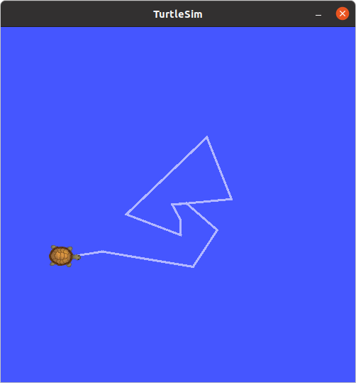
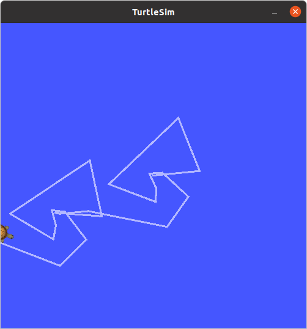

# Day 3 실습 결과: rosbag 데이터 기록과 재생

## 1. 실습 1: 거북이 움직임 기록 및 재생 (rosbag 기초)

### 1단계: 기록할 토픽 확인
| 용도 | 토픽 이름 |
| :--- | :--- |
| **속도 명령** | `/turtle1/cmd_vel` |
| **거북이 위치** | `/turtle1/pose` |

### 2단계: rosbag record (데이터 기록)
- **실행 명령어**: `rosbag record -O my_turtle /turtle1/cmd_vel /turtle1/pose`
- **기록 결과**: 아래는 `rosbag record`를 통해 거북이의 움직임을 기록한 경로입니다.

### 3단계: rosbag info (기록 정보 확인)
- **확인 명령어**: `rosbag info my_turtle.bag`
- **확인 내용**:
  - `duration`: 약 10초
  - `topics`: `/turtle1/cmd_vel`, `/turtle1/pose` 기록됨

### 4단계: rosbag play (데이터 재생)
- **기본 재생**: `rosbag play my_turtle.bag`
- **반복 재생 (-l)**: `rosbag play -l my_turtle.bag`
- **배속 재생 (-r)**: `rosbag play -r 2 my_turtle.bag` (2배속)

---

## 2. 실습 2: 재생 데이터를 Subscriber로 수신

### 1단계: 메시지 타입 확인
- **명령어**: `rostopic type /turtle1/pose` → `turtlesim/Pose`
- **구성 필드**:
  - `float32 x`
  - `float32 y`
  - `float32 theta`
  - `float32 linear_velocity`
  - `float32 angular_velocity`

### 2단계: pose_listener.py 실행 결과
- `rosbag play`가 발행하는 데이터를 직접 만든 Subscriber 노드(`pose_listener.py`)로 수신하는 데 성공했습니다.
- **핵심 원리**: Subscriber는 데이터의 출처(실제 조작 vs rosbag)와 상관없이 동일한 토픽이 오면 콜백을 실행합니다.

---

## 3. 실습 3: 선택적 기록과 필터링 (도전 과제)

### 1단계: 기록 방식 비교 결과
동일하게 10초간 움직였을 때 저장된 데이터의 차이

| 항목 | all_topics.bag (전체 기록) | cmd_only.bag (선택 기록) |
| :--- | :--- | :--- |
| **토픽 수** | 3개 이상 (`cmd_vel`, `pose` 등) | 1개 (`/turtle1/cmd_vel`) |
| **메시지 수** | 약 600개 이상 | 약 50~60개 |
| **파일 크기** | 상대적으로 큼 (약 50KB+) | 상대적으로 작음 (약 11KB) |

### 2단계: 선택 기록 재생 분석
- `cmd_only.bag` 재생 시, 위치 데이터(`pose`)는 저장되어 있지 않았지만 `turtlesim`이 명령을 받아 움직이면서 **실시간으로 새로운 위치 데이터를 발행**하는 것을 확인했습니다.

---

## 4. 학습 정리

| 명령어 | 역할 |
| :--- | :--- |
| **rosbag record** | 토픽 데이터를 .bag 파일로 기록 |
| **rosbag info** | .bag 파일의 상세 정보 확인 |
| **rosbag play** | .bag 파일의 데이터 재생 (발행) |
| **-O [이름]** | 저장될 파일 이름 지정 |
| **-r [배속]** | 재생 속도 조절 |
| **-l** | 무한 반복 재생 |